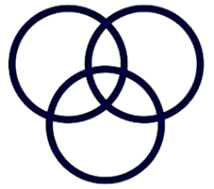
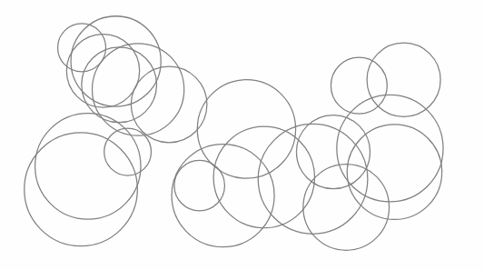

Circle Operations
=================

This repository provides a set of basic geometric circle operations.
The end goal was to create an algorithm that calculates the exact total area of overlapping circles (while overlapping areas would be included only once).
To achieve this step-by-step, a set of classes were created, namely Circle and Point.

 

Quickstart
==========
Basic example for getting the distance between two circles:

    >>> from geom.circl import Circle
	>>> print(Circle([4,10,1]).distance([6,10,1]))
	2

 

Main dependencies
=================
- Numpy
- Pandas

 

Functionalities
===============

Some examples of the classes' methods that are needed to achieve the end goal:

Point
-----
* <code>distance()</code> : Computes the distance between two points.
* <code>centroid()</code> : Computes the centroid of a number of points.
* <code>angleBetween()</code> : Computes the angle between two points and a vertex.
* <code>polyArea()</code> : Computes the area of a polygon.

Circle
------
* <code>intersect()</code> : Computes the intersections of circles.
* <code>get_cluster()</code> : Computes the circle clusters.
* <code>intersectArea()</code> : Computes the intersection area of two circles.
* <code>calcBoundaries()</code> : Computes the boundaries of a circle cluster.

 

More info
=========

Refer to __./demo.ipynb__ for a mostly comprehensive how-to.

 