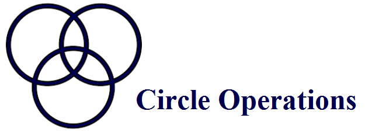

=================

This repository implements basic circle operations in a couple of classes and methods. 
The *original goal* was to create a function that calculates total area of overlapping circles (while overlapping areas would be included only once).
It became quickly clear however that a more structured approach was needed. 
Basic example usage::

    from geom.circl import Circle
	
    if Circle([4,10,1]).distance([6,10,1]) != 2:
	    raise ValueError

	
Dependencies
============

1. Numpy 1.14.0
2. Pandas 0.22.0
	

Functionalities
===============

Some examples of the classes' methods that are needed to achieve the *original goal*:

Point
-----

* Distance
* Centroid
* Polygon Area
* Angle Offset
Circle
------

* Cluster
* Intersection
* Intersection Chord
* Circular Segment
* Intersection Area

More info
=========

Refer to the jupyter notebook for a quick explanation of how to use it.